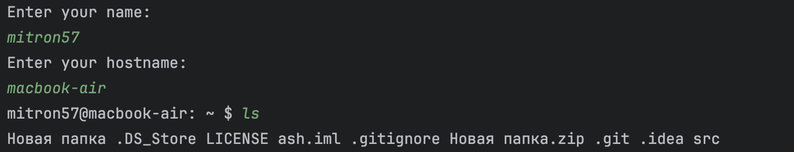
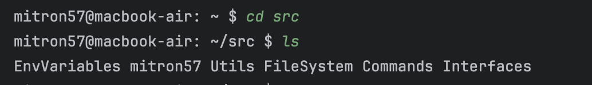
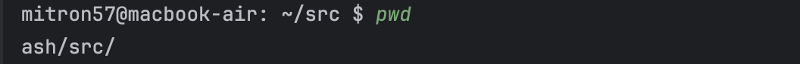
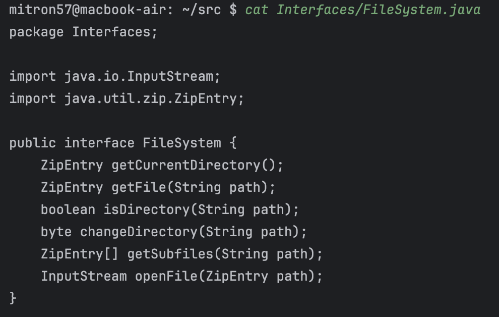
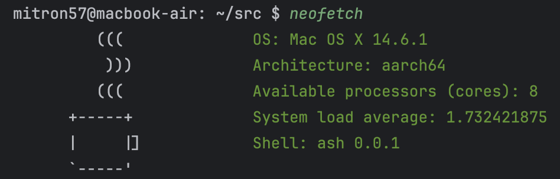

# ash
Эмулятор консоли, поддерживающий некоторые unix-like команды, такие как: cd, pwd, ls, cat, neofetch

# Параметры запуска и команды
Использование: java -jar ash.jar [options]
- **-fs, --filesystem <path>** - Указать файловую систему (обязательно)
- **-h, --help** - Показать сообщение помощи

## Команды
- **exit** – Выход из консоли
- **pwd** – Вывести путь до текущей папки
- **ls** <path> – Просмотреть файлы в <path>
- **cd** <path> - Перейти в директорию по <path>
- **cat** <file> - Вывести содержимое <path>
- **neofetch** - Вывести информацию о системе

# Тесты
## ls

## cd

## pwd

## cat

## neofetch
